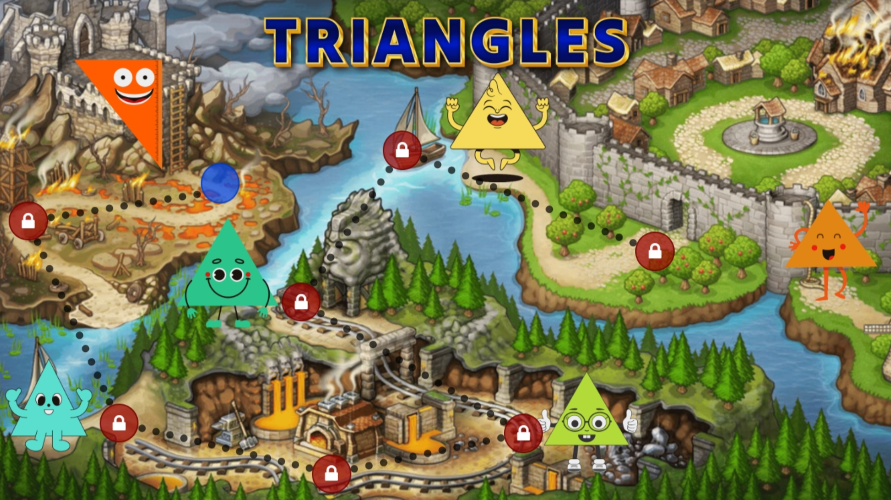
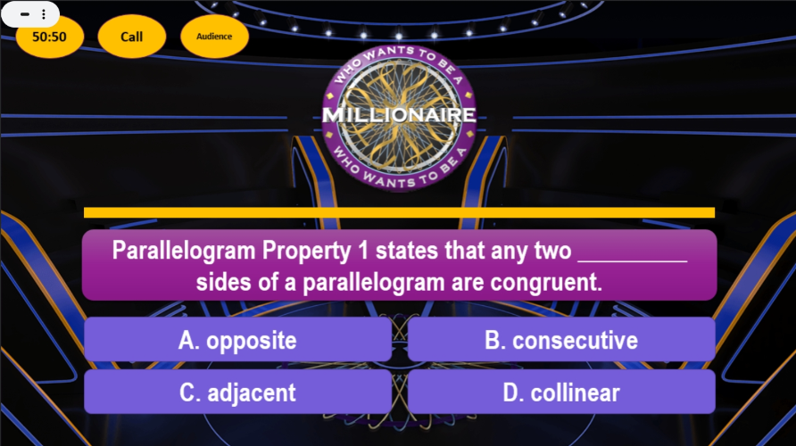

# [🏠 Christony Duyapat](https://duyapat-christony.github.io) 

### Mathematics Instructional Materials
This repository contains instructional materials that I have created and will continue to add.

| Name  | Description | Preview  |
|-----------|----------|----------|
| [Classifications of Triangles](https://duyapat-christony.github.io/teaching_math/classifications_of_triangles.html) | This interactive game map combines video lessons and activities to teach the different types of triangles based on their angles and sides. |   |
| [Who Wants To Be A Millionaire - Parallelogram Edition](https://duyapat-christony.github.io/teaching_math/wwtbm_parallelogram_edition.html) | This PowerPoint presentation is a 'Who Wants To Be A Millionaire' game designed to conclude the chapter on the properties of parallelograms. |  |
| [Math Quotes](https://duyapat-christony.github.io/teaching_math/math_quotes.html) | This is a math quotes generator which I have used in one of my activity. |  |
